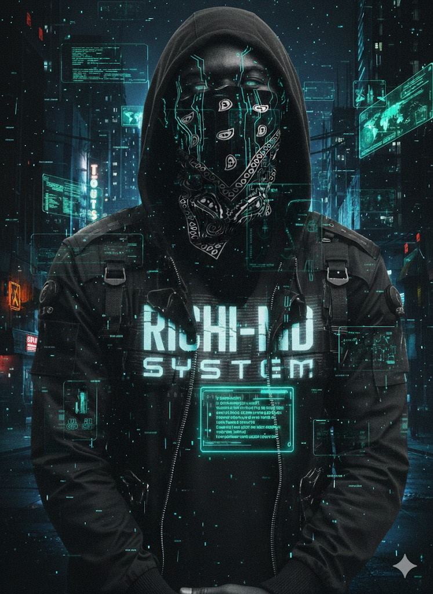

<p align="center">
  
</p>

<h1 align="center"><code> ⚠️ RICHI-MD : KERNEL_OVERRIDE ⚠️ </code></h1>

<p align="center">
  
  
  
</p>

<p align="center">
  <b>Advanced WhatsApp Modular Framework for Cyber-Operators.</b><br>
  <i>L'interface de contrôle ultime pour la gestion de flux WhatsApp.</i>
</p>

---

## 🖥️ [ SYSTEM_MANIFESTO ]

**RICHI-MD** n'est pas qu'un simple bot. C'est un **noyau (kernel)** conçu pour l'efficacité, la discrétion et la puissance. Basé sur l'architecture `gifted-baileys`, il permet une intrusion légère et une gestion modulaire des paquets de données.

### ⚡ Core Capabilities / Capacités du Noyau
* 🔓 **ViewOnce Bypass** : Interception et extraction furtive des flux à vue unique vers les archives privées.
* 🛡️ **Hardened Shield** : Protection active contre le spam, les liens malveillants et les tentatives d'exécution distante.
* 🔌 **Neural Pairing** : Connexion instantanée via code d'appairage sécurisé (No QR needed).
* 🧠 **Fast-Load Logic** : Démarrage à froid en moins de 3 secondes.

---

## 🚀 [ DEPLOYMENT_PROTOCOLS ]

### 📡 Option A : Cloud Interface (Render / Koyeb / Heroku)
> **STATUS:** RECOMMANDÉ POUR 24/7 OPS

1. **FORK** ce dépôt sur votre profil GitHub.
2. Connectez votre compte à la plateforme de votre choix.
3. Configurez les **Variables d'Environnement (Env Vars)** :

| VARIABLE | DESCRIPTION | VALEUR |
| :--- | :--- | :--- |
| `OWNER_NUMBER` | Identifiant opérateur | `242xxxxxxxxx` |
| `BOT_NAME` | Nom du noyau | `RICHI-MD` |
| `PREFIX` | Clé d'accès | `.` |
| `DEFAULT_LANG` | Langue du système | `fr` |

### 📟 Option B : Terminal Local (Termux / Linux / VPS)
```bash
pkg update && pkg upgrade -y
pkg install git nodejs-lts ffmpeg -y
git clone [https://github.com/votre-user/RICHI-MD.git](https://github.com/votre-user/RICHI-MD.git)
cd RICHI-MD
npm install
npm start